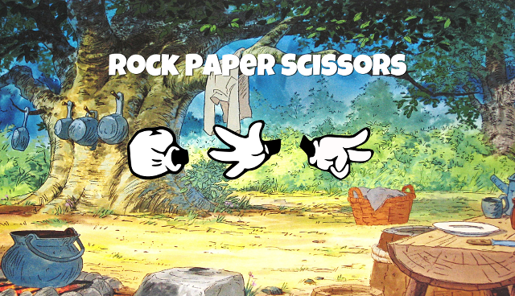
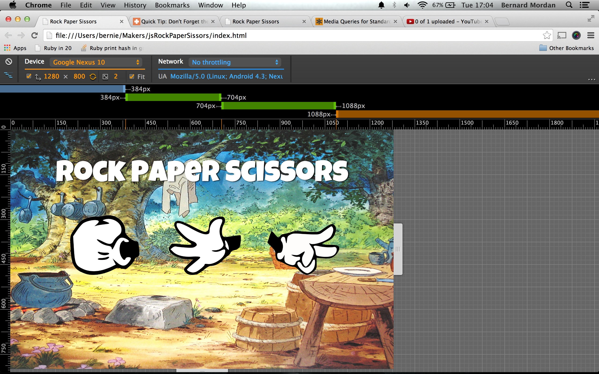

#Rock Paper Scissors

###javascript jQuery responsive design
Our first tentative steps into the browser with the friendly jQuery library as our companion. Click on the screen shot to see the app in action.

I spent the afternoon refining my responsive breakpoints. I like using .em as a measure rather than .px I also wanted to build my own sheet from scratch to really feel the breakpoints for myself. I have also spent the afternoon really enjoying the dev tools in the chrome browser, such awesome work by the creators of chrome makes styling quite fun. Watch a video of it below...

 